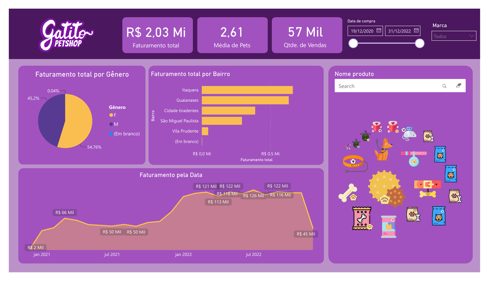

# Gatito Petshop — Dashboard de Análise de Vendas (Power BI)

Projeto desenvolvido durante o curso **"Preparando o ambiente"** da formação de Power BI da Alura, com o objetivo de praticar modelagem de dados, criação de medidas DAX e construção de visualizações interativas. O dashboard simula a análise de vendas de um petshop fictício, a **Gatito Petshop**.

## Preview do dashboard

## Sobre o projeto

O dashboard analisa dados de **vendas, produtos e clientes** de um petshop, permitindo visualizar faturamento, distribuição por gênero e bairro, evolução de vendas ao longo do tempo e catálogo de produtos, com filtros interativos por período e marca.

**Principais indicadores (KPIs):**
- Faturamento total: **R$ 2,03 Mi**
- Média de pets por cliente: **2,61**
- Quantidade de vendas: **57 Mil**

**Período analisado:** dezembro de 2020 a dezembro de 2022

## Modelo de dados

O projeto utiliza um modelo relacional com as seguintes tabelas:

| Tabela | Descrição | Principais colunas |
|---|---|---|
| **Vendas** | Fato de transações de venda | Transação, Data de compra, ID Consumidor, ID Produto, Quantidade, Valor unitário, Faturamento |
| **Produtos** | Dimensão de produtos | ID Produto, Nome produto, Categoria, Marca, Valor, Url img |
| **Clientes** | Dimensão de clientes | ID Consumidor, Gênero, Estado civil, Pets, Bairro |
| **Calendário** | Tabela de datas para análise temporal | Data, Ano, Mês, Trimestre, Dia |

## Medidas DAX

- **Faturamento total** — soma do faturamento gerado nas transações de venda

## Visualizações

- Cards de KPI — Faturamento total, Média de pets, Quantidade de vendas
- Gráfico de pizza — Faturamento total por gênero
- Gráfico de barras — Faturamento total por bairro
- Gráfico de área — Faturamento ao longo do tempo (jan/2021 a jul/2022)
- Grid de imagens — catálogo visual de produtos com busca (Nome produto)
- Filtros (slicers) — período (Data de compra) e Marca

## Tecnologias e conceitos aplicados

- Power BI Desktop
- Modelagem de dados relacional (star schema)
- DAX (Data Analysis Expressions)
- Power Query (ETL)
- Visualizações customizadas (Custom Visuals)

## Como abrir o projeto

1. Baixe o arquivo [`Preparando_ambiente_3775_aula03.pbit`](./Preparando_ambiente_3775_aula03.pbit)
2. Abra com o [Power BI Desktop](https://powerbi.microsoft.com/pt-br/desktop/) (Windows)
3. Ao abrir, o Power BI vai solicitar a conexão com a fonte de dados original

## Autora

**Helena Nery**
[LinkedIn](https://www.linkedin.com/in/helenanery) · [GitHub](https://github.com/helenanery)

---
*Projeto realizado como parte da trilha de Power BI da [Alura](https://www.alura.com.br/).*
